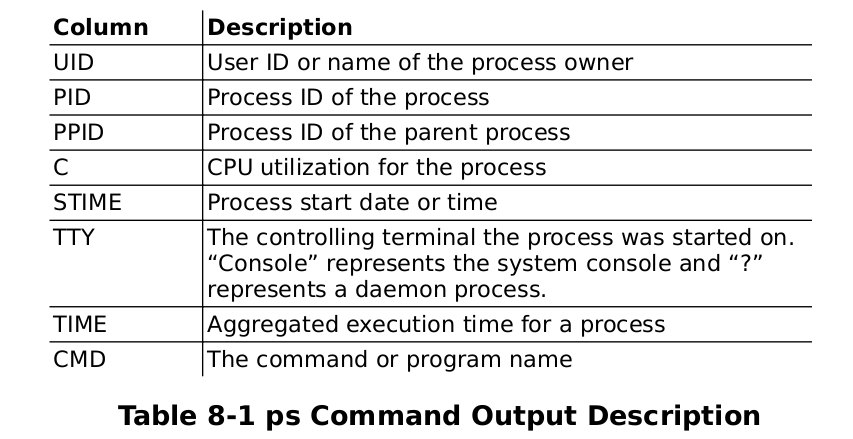

# Conferencia_LPA
Repositorio con material de apoyo para la conferencia Linux para adminstradores de sistemas - 31 de Agosto - ECYS

# Comandos Expuestos
---
# Procesos

## Monitoreo de procesos. 

Para ver todos los procesos activos utilizamos: 
```bash
    sudo ps -efl
```
Definición de las columnas de la salida del comando `ps`



Comando para buscar el PID de un proceso por su nombre

``` bash
    pidof <nombre>    
```
Salida esperada: 

``` bash
    user@host:~$ pidof rsyslogd 
    1466
```
---
# Programación de tareas
## Crontab y Anacron
Con estas herramientas es posible poder programar tareas que se ejecuten en un determinado momento, definido por: minuto, hora, día de la semana, día del mes, mes

Para realizar esto podemos añadir una entrada al archivo de configuración localizado en `/etc/crontab` en el cual podemos encontrar lo siguiente

```log
# Example of job definition:
# .---------------- minute (0 - 59)
# |  .------------- hour (0 - 23)
# |  |  .---------- day of month (1 - 31)
# |  |  |  .------- month (1 - 12) OR jan,feb,mar,apr ...
# |  |  |  |  .---- day of week (0 - 6) (Sunday=0 or 7) OR sun,mon,tue,wed,thu,fri,sat
# |  |  |  |  |
# *  *  *  *  * user-name command to be executed
  17 *	* * *	root    cd / && run-parts --report /etc/cron.hourly
  25 6	* * *	root	test -x /usr/sbin/anacron || ( cd / && run-parts --report /etc/cron.daily )
  47 6	* * 7	root	test -x /usr/sbin/anacron || ( cd / && run-parts --report /etc/cron.weekly )
  52 6	1 * *	root	test -x /usr/sbin/anacron || ( cd / && run-parts --report /etc/cron.monthly )
```
Es posible agregar una entrada con el formato: 
```log
    # en esta entrada indicamos que se realice un comando a cada 5 minutos 
    # de lunes a viernes    
    0-59/5  *  *  *  1-5  *  command
    # en esta entrada indicamos que se realizara un comando pasada la media noche
    # del día 1 de los meses de abril, junio, septiembre y noviembre
    1  0  1  4,6,9,11  *  *  command
```
También es posible agregar script en las carpetas 
```log 
    /etc/cron.daily/   
    /etc/cron.hourly/  
    /etc/cron.monthly/ 
    /etc/cron.weekly/
```
Para que se ejecuten en conjunto con las tareas del sistema

La configuración de anacron es posible encontrarla en `/etc/anacrontab`


## At, Batch, ATQ, ATR
Es posible programar tareas para que se ejecuten una *sola vez* en un determinado momento ó cuando el sistema se encuentre en baja carga. 

Para ejecutar una tarea una sola vez en un determinado momento podemos usar el comando `at`
´´´bash
    at 11:45pm 
    at> echo "Tarea en ejecución" > tty7
    at> Control-d
´´´
ó 
```bash 
    at 11:45pm < <script>    
```

el comando `at` soporta multiples entradas como lo puede ser: 

```log
     4 am Saturday
     1930
     11:45pm August 31
    now + 20 minutes
```
el comando `batch`es muy similar al comando `at` salvo que su ejecución se realiza cuando el sistema tienen una carga de `<0.8`

Para ver las tareas con su ID pendientes en ejecutarse podemos utilizar el comando `atq`
Para eliminar tareas pendientes por ejecutarse poemos utiliar el comando `atrm <numero de tarea>` 

---
# Herramientas de monitoreo
 *  nmon
 *   qatop
 *  glances
---
# systemd
El init usado en la mayoría de distribuciones empresariales reemplazando a SysV presente en la mayoría de distribuciones de hace 10-5 años atrás hasta su adopción generalizada durante los últimos años. Tiene la particularidad de paralelizar las tareas lo que permite inicializar los servicios de una forma más rápida. 

Para observar todas las unidades cargadas en el sistema por systemd utilizamos el siguiente comando: 

```bash
    sudo systemctl list-units 
```


## Servicios

Con systemd las configuraciones de los servicios en lugar de ser lineas de comandos largas y complejas, ahora son archivos más sencillos que indican todo lo que se debe de hacer, antes de iniciar un servicio y qué condiciones debe indicar el servicio que se han cumplido cuando finaliza el inicio. 

La mayoría de configuraciones de servicios las podemos encontrar en estas ubicaciones: 
```bash
    /etc/systemd/system #siendo esta la más común

    /usr/lib/systemd/system

    /lib/systemd/system
```

Para listar todas la unidades
```bash
    sudo systemctl list-units -a
```

Para listar todos los servicios activos  de systemd utilizamos el siguiente comando
```bash 
    sudo systemctl list-units --type service
   # ó 
    systemctl list-units --type=service
```

Para listar todos los servicios de systemd utilizamos el siguiente comando
```bash 
    sudo systemctl list-units --type service --all 
   # ó 
    systemctl list-units --type=service --all 
```

Para listar todas las unidades marcada como fallidas usamos
```bash
    sudo systemctl --failed 
```

## Manejo de servicios

*   Iniciar, detener, reiniciar un servicio (utilizando httpd, el servidor web Apache, como ejemplo) en un sistema actual:
    ``` bash
        sudo systemctl start|stop|restart <nombre servicio><.service>?
        #ejemplo
        sudo systemctl start|stop|restart httpd.service
    ```

*   Habilitar o deshabilitar un servicio del sistema para que no se inicie durante el arranque del sistema:
    ``` bash
        sudo systemctl enable | disable <nombre serivicio><.service>?
        #ejemplo
        sudo systemctl enable | disable httpd.service 
        # ó
        sudo systemctl enable | disable httpd 
    ```
*   Reconfigurar un servicio
    ``` bash
        sudo systemctl reload <nombre servicio><.service>?
        #ejemplo
        sudo systemctl reload httpd.service
    ```
*   Para conocer los servicios que son necesarios para un servicio
    ```bash
        sudo systemctl list-dependencies --after <nombre servicio><.service>?
        #ejemplo
        sudo systemctl list-dependencies --after httpd
    ```
*   Para conocer los servicios que dependen de un servicio
    ```bash
        sudo systemctl list-dependencies --before <nombre servicio><.service>?
        #ejemplo
        sudo systemctl list-dependencies --before httpd      
    ```
*   Para verificar si un servicio comienza con el sistema
    ```bash
        sudo systemctl is-enabled <nombre servicio><.service>?
        #ejemplo
        sudo systemctl is-enabled docker.service      
    ```
    
## Otros comandos útiles: 

Para analizar el rendimiento del equipo al iniciar podemos utilizar: 

```bash
    # muestra cuanto tarda en iniciarse un equipo
    systemd-analyze time

    # muestra todos los procesos que se ejecutan al inicio
    sudo systemd-analyze blame

    # muestra la ruta crítica del inicio
    sudo systemd-analyze critical-chain

    # crea un gráfico en SVG que detalla el proceso de inicio
    sudo systemd-analyze plot > salida.svg

    # crea un mapa de dependencias de un servicio o unidad determinada (requiere tener instalado dot )
    systemd-analyze dot 'nombre.*' | dot -Tsvg >nombre.svg

    #ejemplo para docker
    systemd-analyze dot 'docker.*' | dot -Tsvg >avahi.svg

    #para generar una entrada en el log de la salida de un programa se puede utilizar: 
    comando a realizar | systemd-cat
    #ejemplo 
    vmstat | systemd-cat

    # para restablecer todas las unidades
    sudo systemctl preset-all 

    # para obtener información de la unidad
    sudo systemctl show <nombre unidad>
    # ejemplo
    sudo systemctl show docker.

    # para obtener el manual de la unidad (no siempre disponible)
    sudo systemctl help <nombre unidad>
```
    
---
# Memoria
## Cache 

La cache consiste en archivos temporales guardados por el kernel en RAM para acelerar los procesos de arranque de algunos programas y archivos accedidos con anterioridad

Comando para eliminar caches: 
```bash 
    #este comando activa el proceso de eliminación de caches del sistema escribiendo un 3 en este archivo
    sudo echo 3 > /proc/sys/vm/drop_caches
    ó 
    sudo sysctl vm.drop_caches=3
```
Los posibles valores son: 
*   0: No libera nada
*   1: Libera la pagecache
*   2: Libera inodos y dentries
*   3: Libera pagecache, inodos y dentries

### Comportamiento de la cache

El kernel tienen un valor almacenado en `/proc/sys/vm/vfs_cache_pressure` este valor indica el nivel de exigencia que tendrá el kernel para reclamar memoria de la caché y liberarla, un valor de 0 hará que el kernel no pida ningún tipo de cache, por lo tanto llenará la ram de cache y podría ocasionar una sobrecarga por falta de memoria y si tiene un valor muy alto el kernel se abstendrá de emplear cache lo máximo posible, accediendo todo el tiempo al disco pero manteniendo la memoria principal libre. 

Para ver el estado actual del valor usamos el siguiente comando 
```bash
    cat /proc/sys/vm/vfs_cache_pressure 
    #
    sudo sysctl -n vm.vfs_cache_pressure
```
El valor por defecto es `100` y es ideal para la mayoría de casos, pero en ciertas situaciones es conveniente aumentarlo o disminuirlo, si tenemos un servidor al cual pocos archivos son accedidos pero de forma recurrente sería buena idea mantener un valor bajo para que estos archivos se encuentren en cache y tengan mayor disponibilidad, en caso contrario donde tenemos un servidor con muchos archivos accedidos de forma frecuente podemos tener un valor alto para que solo los archivos más utilizados se encuentren en cache, dejando espacio en memoria para las demás peticiones poco recurrentes. 

Este valor se pueden modificar con el siguiente comando
```bash
    sudo sysctl vm.vfs_cache_pressure=50
```
Para que el cambio sea persistente añadimos al final del archivo `/etc/sysclt.conf` la siguiente linea `vm.vfs_cache_pressure=<valor>` 

    
## SWAP
Recomendaciones para la asignación de de swap
*   Sistemas con menos de `2 GB` de ram el doble de la ram 
*   Sistemas con `2` a `8 GB` de ram la misma cantidad de ram y de swap 
*   Sistemas con más de `8 GB` de ram al menos `4 GB` de swap ó más dependiendo del consumo de memoria de las aplicaciones del servidor. 


### Creación de archivo para swap

Para crear un archivo de swap usamos el siguiente comando siendo `2G` el espacio en GB 

```bash 
    sudo fallocate -l <tamaño> <dirección absoluta / nombre archivo>
    #ejemplo 
    sudo fallocate -l 2G /swapf
```

Establecemos los permisos 
```bash 
    sudo chmod 600 <dirección absoluta / nombre archivo>
    #ejemplo 
    sudo chmod 600 /swapf

```
Luego marcamos el archivo para utilizarse como swap con el comando `mkswap`

```bash 
    sudo mkswap <direcion absoluta / nombre archivo>
    #ejemplo
    sudo mkswap /swapf
```
Posteriormente montamos el archivo para generar funcionar como swap con el archivo `swapon`
```bash 
    sudo swapon <dirección absoluta / nombre archivo>
    #ejemplo
    sudo swapon /swapf 
```
Este archivo de swap estará activo durante la ejecución del sistema hasta su reinicio, si se desea que se monte siempre al inicio del sistema hacemos lo siguiente

Editamos el archivo `/etc/fstab` usando nano ú otro editor de su preferencia

```bash 
    sudo nano /etc/fstab
```
y añadimos la siguiente linea al final del archivo

```bash
    <direcion absoluta / nombre archivo> swap swap defautls 0 0 
    #ejemplo
    /swapf swap swap defaults 0 0
```
Esto hará que el archivo swap se utilice como swap al arranque del sistema

### Configuración de la swap
La configuración de la swap se realiza escribiendo un valor en el archivo: `/proc/sys/vm/swappiness`, el valor puede ser entre `0`y `100` , un valor alto hará que el sistema haga un mayor uso de swap cuando sea posible, al cambio si es un valor muy bajo el sistema no utilizará la swap salvo cuando sea realmente necesario, para configurar este valor utilizamos el siguiente comando


```bash
    # el valor 60 es el más común en la mayoría de distribuciones para escritorio 
    # 30 para distribuciones enfocadas a servidor
    sudo sysctl vm.swappiness=60
    # ó 
    sudo echo 60 > /proc/sys/vm/swappiness 
```

```bash
    # Utilizamos el comando cat para visualizar los cambios
    cat /proc/sys/vm/swappiness 
    #
    sudo sysctl -n vm.swappiness
```
Para que el cambio sea persistente añadimos al final del archivo `/etc/sysclt.conf` la siguiente linea `vm.swappiness=<valor>`

### Eliminación de swap
En algunas ocasiones es deseable deshabilitar la swap, para ello podemos hacer uso del siguiente comando: 

```bash
    # para deshabilitar todas las particiones y archivos de swap
    sudo swapoff -a
    ó 
    # para deshabilitar un archivo/partición en específico
    sudo swapoff -v <nombre archivo / particion>
```

---
# SysRQ - REISUB: ¡¡REInicia SUBnormal!!
 

SysRQ es una combinación de teclado, la cual utiliza la tecla `ImpPrint/SysRq/Pet Sis`  que permite rescatar el sistema cuando ocurre una sobrecarga de memoria por un proceso fuera de control ó un problema del sistema. 

En la mayoría de sistemas esta opción esta deshabilitada, verificar el estado de esta opción usamos el siguiente comando

```bash
    cat /proc/sys/kernel/sysrq
```
Si el resultado es diferente de `1` entonces la opción esta deshabilitada, para habilitarla de forma temporal aplicamos el siguiente comando: 

```bash
    sudo sysctl kernel.sysrq=1
    # ó en modo root
    echo "1" > /proc/sys/kernel/sysrq
```
Si se desea que este ajuste sea persistente, añadimos la linea `kernel.sysrq=1` al final del archivo `/etc/sysctl.d/99-sysctl.conf` si no existe se debe de crear


La clave en estos comando es recordar la palabra REISUB la cual consiste en lo siguiente: 

Las combinaciones son: 
|Combinación |Acción | 
| ----------- | ----------- | 
|`Alt + SysRq + r` | Pasa al teclado de `RAW Mode` a `XLATE mode`  |
|`Alt + SysRq + e` | Envia `SIGTERM` a todos los procesos excepto el init|
|`Alt + SysRq + i` | Envia `SIGKILL` a todos los procesos excepto el init|
|`Alt + SysRq + s` | Sincroniza todas las particiones (vacía los bufferes del sistema de archivos) |
|`Alt + SysRq + u` | Remonta todas las particiones en modo sólo lectura |
|`Alt + SysRq + b` | Reinicia el sistema|
---

# Herramientas para Logs 

En la mayoría de logs se encuentran en la carpeta `/var/log` sobre los servicios, procesos del sistema. 

Existen algunas utilidades para poder visualizar los logs de una mejor manera

nivel de login para journalctl 
Por subsistema: 

0. (Kernel - kern) -> Mensajes del kernel
1. (Usuario - user) -> Mensajes del nivel de usuario
2. (Mail - mail) -> Sistema de correo 
3. (Demonio - daemon) -> Demonios de sistema
4. (Autenticación - auth) -> Seguridad / Autorización 
5. (Syslog - syslog) -> Mensajes generados internamente por syslogd
6. (Impresión - lpr) -> Subsistema de impresión
7. (Noticias news) -> Subsistema de noticias sobre la red
8. (uucp) -> Subsistema UUCP 
9. -> Demonio de reloj
10. (Autorización - authpriv) -> Seguridad/Autorización
11. (FTP - ftp) -> Demonio de FTP
12. -> Subsistema de NTP 
13. -> Inspección del registro 
14. -> Alerta sobre el registro 
15. (clock) -> Demonio del reloj
16. (local0) -> Uso local 0
17. (local1) -> Uso local 1
18. (local2) -> Uso local 2
19. (local3) -> Uso local 3
20. (local4) -> Uso local 4
21. (local5) -> Uso local 5
22. (local6) -> Uso local 6
23. (local7) -> Uso local 7

Por facility

0. (Emergencia - panic ) ->  El sistema está inutilizable
1. (Alerta - alert) -> Se debe actuar inmediatamente
2. (Crítico - crit) -> Condiciones críticas
3. (Error - err) -> Condiciones de error
4. (Peligro - warn) -> Condiciones de peligro
5. (Aviso - notice) -> Para condiciones notables
6. (Información - debug) -> Mensajes de depuración / bajo nivel
7. (Depuración - debug) -> Mensaje de bajo nivel


La configuración de la rotación y copia de seguridad de los logs se encuentra en: `/etc/logrotate.conf` e incluye los archivos en la carpeta: `/etc/logrotate.d`. 


## Logs básicos: 

Para ver la información del último arranque del sistema usamos 

```bash
    cat /var/log/dmesg
    # ó 
    dmesg

```
`dmesg` posee diversos opciones como lo es el filtrado por prioridad o facility, para mas información podemos consultar el manual con `dmesg -h`


Para observar los últimos inicios de sesión: 
```bash
    last
```
Para observar los últimos inicios de sesión fallidos
```bash
    sudo lastb
```
Para observar los logs del último día podemos buscar en el archivo `/var/log/syslog`
```bash
    sudo cat /var/log/syslog
```

Los mensajes del kernel se encuentran en este archivo: `/var/log/kernel.log`

## journalctl
Es el manejador de logs de systemd, su configuración principal se encuentra en: `/etc/systemd/journald.conf`

En algunas ocasiones para ver completamente la configuración se puede utilizar el siguente comando: 

```bash
    systemd-analyze cat-config systemd/journald.conf
```

Mensajes del kernel 
```bash 
    journalctl -k -b  
```
Mensajes de un servicio
```bash
    journalctl -u <servicio>    
```

Para ver todas las entradas en tiempo real
```bash
    journalctl -f
```

Mensajes en tiempo real de un servicio
```bash 
    journalctl -f -u <servicio>    
```
Mensajes de cuantas veces han arrancado el sistema 
```bash
    journalctl –list-boots
```
Para ver los registros de un PID
```bash
    journalctl _PID=<número>
```
### Registros

Para ver los registros de forma inversa 
```bash
    journalctl -r
```

Para ver los registros de una unidad
```bash
    journalctl --unit=<nombre unidad>
```

Para ver los registros de una forma más detallada se puede usar: 
```bash
    journalctl --output=verbose
```
Para mostrar una cierta cantidad de líneas 
```bash
    journalctl --lines=<número de líneas>    
```

Para mostrar registros con cierto nivel de prioridad
```bash
    journalctl --priority= (0-7|emerg|alert|crit|err|warning|notice|info|debug)
```
Para mostrar los registros en cierto intervalo de tiempo se puede utilizar `--since` `--until` siendo el formato `“yyyy-mm-dd hh:mm:ss”`, hay formatos alternativos como `1 hour ago`, `yesterday` , `today` entre otras.

```bash
    #ejemplo
    journalctl --since="2022-01-01" --until="2022-05-01"

```
Todos estos filtros pueden mezclarse para analizar los logs por ejemplo 

```bash
    #ejemplo
    # se mostrarán en reversa los registros del 01-01-22 al 01-05-22 del servicio NetworkManager  de tipo warning 
    journalctl -r --since="2022-01-01" --until="2022-05-01" --priority warning  --unit NetworkManager.service 
```
En algunos casos las prioridades no están bien definidas, por lo tanto se puede usar el parámetro `--grep` para filtrar las prioridades por ejemplo 

```bash
    #se mostrará en reversa los registros del 01-01-22 al 01-05-22 del servicio docker.service de tipo warning 
    journalctl -r --since="2022-01-01" --until="2022-05-01"   --unit docker.service --grep warning
```

### Otros comandos útiles
Para conocer el tamaño que ocupan los registros en nuestro sistema podemos utilizar 
```bash
    journalctl --disk-usage
```

Para vaciar los registros y dejar solo cierto tamaño : 
```bash
    journalctl --vacuum-size=<tamaño> (K|M|G|T)
    #ejemplo
    journalctl --vacuum-size=2M 
```
Para vaciar los registros de un determinado tiempo
```bash
    journalctl --vacuum-time=<tiempo>(s|m|h|days|moths|weeks|years)
    #ejemplo
    journalctl --vacuum-size=1month
```


## rsyslogd

La configuración de rsyslog se encuentra en `/etc/rsyslog.conf` y también los archivos contenidos en la carpeta `/etc/rsyslog.d`

```bash 
    rsyslogd    
```
### Creación de Logs
Para esto se utilizan los users spaces ya que son espacios para el usuario, para hacer uso de estos vamos a el archivo de configuración y usaremos el `local7`

Abrirmos el archivo `/etc/rsyslog.d/50-default.conf`

```bash
    sudo nano /etc/rsyslog.d/50-default.conf
```
Añadimos las siguientes lineas debajo de la configuración de mail o new
```
local7.*                        /var/log/loca7.log  #
local7.err                      /var/log/local7_err.log 
```
Para que los cambios tengan efecto reiniciamos el servicio de rsyslog con 

```bash 
    sudo systemctl restart rsyslog.service 
```

Para probar que funciona el loggin personalizado creamos una nueva entrada con el siguiente comando usando `logger`

```bash 
    logger -p local7.info "Mensaje de información" 
    # o con journal 
     journalctl -f
```
Podemos hacer un cat `/var/log/local7.log` y observar que efectivamente se ha guardado el registro

Para guardar un error podemos utilizar: 
```
    logger -p local7.err "Esto es un error"
    # o con journal 
     journalctl -f
```

## Logrotate
Para la rotación de Logs podemos usar logrotate y para ello tenemos que configurarlo, para ello vamos a las siguientes configuraciones: 

```bash
    sudo nano /etc/logrotate.d/rsyslog 
```
y añadimos la siguiente configuración
```
#archivos a rotar 
/var/log/local7.log 
#archivos a rotar
/var/log/local7_err.log
#configuración
{
    rotate 2
    size 1k 
    missingok
    notifempty 
    compress 
    postrotate
        /usr/lib/rsyslog/rsyslog-rotate
    endscript

}
```
Si se desea rotar una carpeta entera se añade como `/var/carpeta/*`

Los parametros de configuracion con alto nivel de detalle se encuentra en man 
man logrotate

Para ver la ejecución de tareas de loggin hacemos un cat a `/etc/crontab` y para logrotate a `/etc/cron.daly/logrotate`

Para forzarlo un log rotate ejecutamos la configuración de logrotate mediante
```bash
    sudo logrotate -f /etc/logrotate.conf 
```

# AppArmor
AppArmor es un módulo del kernel linux utilizado para limitar y/o restringir las capacidades de acceso de un programa en específico, siendo este considerado un MAC (name-based access control) / control de accceso obligatorio. Se basa en un sistema de perfiles gestionados por el usuario o un gestor de paquetes. 

Para saber si se encuentra instalado en el sistema utilizamos 

```bash
    sudo systemctl status apparmor.service    
```


## Creación de perfiles Stand-Alone (unitarios)
Estos perfiles se destinan a una sola aplicación, estos son generados por el gestor de paquetes, pero también pueden generarse por medio de la herramienta `aa-genprof`


Para crear un perfil utilizamos el siguiente comando 

```bash 
    sudo aa-genprof <programa>
```

Para ver los perfiles podemos ver con 
```bash
    sudo apparmor_status 
    # ó 
    sudo ls /etc/apparmor.d/
```

Para pasar un perfil a modo complain utilizamos 
```bash
    sudo aa-complain <dirección programa | ubicacion perfil >
    # ejemplo 
    sudo aa-complain /etc/apparmor.d/usr.bin.kate
```
Para tomar retroalimentar el perfil por medio del modo complain utilizamos 
```
    sudo aa-logprof 
```
Para desactivar un perfil podemos utilizar: 
Para pasar un perfil a modo complain utilizamos 
```bash
    sudo aa-disable <dirección programa | ubicacion perfil >
    # ejemplo 
    sudo aa-disable /etc/apparmor.d/usr.bin.kate
```
Para eliminar un perfil hacemos los siguientes pasos
```bash
    sudo apparmor_parser -R /etc/apparmor.d/<Perfil>

    sudo rm /etc/apparmor.d/<Perfil>   

    sudo rm /var/lib/apparmor/cache/<Perfil>

    sudo systemctl reload apparmor.service 
```

---
# Algunas consideraciones: 
Los archivos de configuración (.conf) de la carpeta `/etc` pueden incluso estar fragmentados en diversas ubicaciones dependiendo de la distribución, se les puede encontrar en las siguientes ubicaciones
```bash
    /usr/etc 
    /usr/local/etc
```
Si no se encuentran en estar carpetas, es posible buscar el archivo deseado con el comando `find`


---
# Material complementario: 
https://drive.google.com/file/d/1QaPWJq06zR0OiGjzgFM021wvBPqCJibY/view?usp=sharing

# Enlaces de interés

## Programación de tareas
https://docs.oracle.com/en/operating-systems/oracle-linux/7/monitoring/monitoring-AutomatingSystemTasks.html#ol7-s5-autotask

https://docs.oracle.com/cd/E37929_01/html/E36490/gmacc.html

## Memoria
https://www.grc.com/haystack.htm

https://www.linuxtotal.com.mx/?cont=info_admon_012

https://docs.gluster.org/en/main/Administrator-Guide/Linux-Kernel-Tuning/#commentjdarcy

https://www.kernel.org/doc/Documentation/sysctl/vm.txt


## systemd

https://access.redhat.com/documentation/en-us/red-hat-enterprise-linux/8/guide/e561e1ee-2011-4664-a627-eb8fb4063963

https://wiki.archlinux.org/title/systemd

https://access.redhat.com/documentation/en-us/red_hat_enterprise_linux/8/html/configuring_basic_system_settings/assembly_working-with-systemd-unit-files_configuring-basic-system-settings

https://access.redhat.com/documentation/en-us/red_hat_enterprise_linux/7/html/system_administrators_guide/chap-managing_services_with_systemd

https://www.freedesktop.org/software/systemd/man/systemd.directives.html


## Loggin
https://www.digitalocean.com/community/tutorials/how-to-use-journalctl-to-view-and-manipulate-systemd-logs

## AppArmor

https://documentation.suse.com/sles/15-SP2/html/SLES-all/cha-apparmor-commandline.html

https://gitlab.com/apparmor/apparmor/-/wikis/home

https://gitlab.com/apparmor/apparmor/-/wikis/Profiling_with_tools

https://gitlab.com/apparmor/apparmor/-/wikis/Profiling_by_hand


